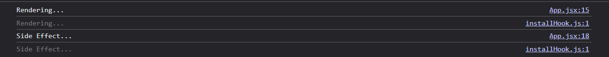
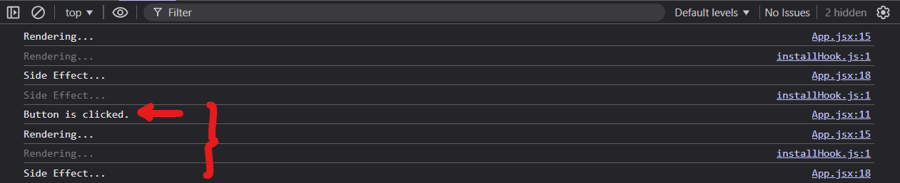

1. If we want to set a function as a state:
    * Good Practice
    ```js
    setMyFunc( () => functionName )
    ```

    * Bad Practice - The following 2 practices will call the function upon setting
    ```js
    setMyFunc(functionName)

    // OR

    setMyFunc(functionName())
    ```

2. When a function is set as a state
    - All the variables within it will be saved as well
    - So when the state function is called, it will not refer to the latest value of the same variable
    - Instead, it will use the variable that it saves when it is set.

    ```js
    export default function App() {
        const [count, setCount] = useState(0)
        const [name, setName] = useState('Alice')
        const [myFunc, setMyFunc] = useState(null)

        function handleClick() {
            setCount(prevCount => prevCount + 1)
            setName('Bob')
            myFunc()
        }

        const showVal = function() {
            console.log('The state setter function captures these values: ')
            console.log('count: ', count)
            console.log('name: ',name)
        }

        if(myFunc === null){
            // The state function is set here: so it records count: 0 and name: Alice
            // In future, when myFunc() is called, it displayd count: 0 and name: Alice regardless of the latest state of count and name
            setMyFunc(() => showVal )
        }

        return (
            <>
            <button onClick={handleClick}>Click me</button>
            <p>{count}</p>
            <p>{name}</p>
            </>
        )
    }
    ```

3. When we want to set state by using a value returned by a function

    * Good Practice
    ```js
    const [item, setItem] = useState( () => functionName())
    //OR
    setItem( () => functionName())
    ```

    * Bad Practice - for useState
        - The function will get called every single rerendering...
    ```js
    const [item, setItem] = useState( functionName())
    ```


4. When does rerendering happens?
    - Normally:
        - When one of the state resides within the top level of a component is changed.
        - Whether the state is changed or not, it depends on `Object.is()` - Refer to: https://developer.mozilla.org/en-US/docs/Web/JavaScript/Reference/Global_Objects/Object/is
    
    - An exception to watchout:
        - When a value is set back to the same previous value for the first time, rerendering will take place.
        - If subsequently, the value is still set back to the same previous value, then rerendering will stop taking place.
    

5. UseEffect - resolve sequence in relation to parents
    - Parent (Main content) gets rendered
    - Child (Main content) gets rendered
    - Child (Side Effect) gets rendered
    - Parent (Side Effect) gets rendered


    

6. Use Effect, Use Memo resolve sequence
    - If there is no `dependecy`, always run
    - If `dependency = []`, run at least once
    - If `dependency = [...some content...]`, run if the content has changed (also depending on `Object.is` as discussed above...)

    - When there is dependency:
        - When it is run for the first time, the current value will get save
        - Subsequently, it will always put in the current value and if it differs from the previous value, then the content will get run

    ```js
    useEffect( ()=> {
        // Content to be run
    }, [dependency1, dependency2, dependency3...])
    ```


7. Dependencies for UseEffect, UseMemo... ***DO NOT*** need to be necessary be part of the content to run the content

8. useMemo
    - same as 6)a)
    - used to save value across rendering
    - upon mounting of the component, it will run its function and return a value to be saved into a const
    - If any of the dependencies change in the future rendering, then it will get loaded and return a new value
    - Else, the function will not run again in future rendering.
    
    
9. Strict Mode:

    ```jsx
    export function App(){

        const [count, setCount] = useState(0)
        
        function handleClick(){
            console.log('Button is clicked.')
            setCount(prevCount => prevCount + 1)
        }
        
        console.log('Rendering...')

        useEffect( () => {
            console.log('Side Effect...')
        }, [count])

        return (
            <>
                <p>{count}</p>
                <button onClick={handleClick}>Click me</button>
            </>
        )
    }
    ```

    * In strict mode, the following events happen in this order upon loading.
        - a) The main component renders twice
            - In console, it can be seen that 'Rendering...' is logged x2 times.
                * First time, it is in bright.
                * Second time, it is in slightly dimmer color. (Indicating that this is triggered due to strict mode)

        - b) After that, the effect gets triggered twice
            - More precisely, the main function gets run.
            - ***Followed by cleanup function if its defined.***
            - Then the main function gets run again.
            - Hence, in the console, it can be seen that 'Side Effect...' is logged x2 times.
        
        
    
    * Subsequently, when the button is clicked,
        - a) 'Button is clicked' is first logged.
        - b) 'Rendering' gets logged x2 times (1 bright, 1 dim) because Strict Mode always render the main content x2 times.
        - c) 'Side Effect...' is then logged x1 only
            - This is because the effect is only triggered twice (setup => cleanup => setup) when the component ***is first mounted***.
            - After that, when it has to be run (due to dependencies change), only the cleanup => setup cycle gets run.
        
        


10. Case Study - What will be logged out?

    ```jsx
    export function App() {
        // State
        const [questions, setQuestions] = useState([])
        const [categories, setCategories] = useState([])

        console.log('Rendering')
        console.log(categories)

        // Derived State
        const isGameStart = questions.length > 0    // The game is considered started if the questions are populated
        
        // -----------------
        // Function for Home
        // -----------------
        function handleStart(){
            console.log('Game Start')
        }


        // ----------
        // Use Effect
        // ---------- 
        useEffect( () => {

            // Effect 1 - Load the latest categories
            // When (isGameStart changes or when the page is first loaded) 
            // AND the game is not started
            if(!isGameStart){

                async function fetchCategories(){
                    console.log('Start Fetching..')
                    const res = await fetch("https://opentdb.com/api_category.php")
                    const data = await res.json()
                    if (!res.ok){
                        throw new Error(`Fail to load categories.`)
                    }
                    console.log('Done fetching..')
                    setCategories(data.trivia_categories)
                }
                fetchCategories()
            
            }

        }, [isGameStart])

        // ------
        // Return
        // ------
        return (
            <>
                { isGameStart 
                    ? <Quiz />
                    : <Home 
                        handleStart = {handleStart}
                    /> 
                }
            </>
        )
    }
    ```

    * Explanation (If Under Strict Mode)
        - These following are basically rendering of the main component (the dim ones are caused by rerendering because of strict mode)
            - `Rendering...` (Bright)
            - `Categories` (Bright)
            - `Rendering...` (Dim)
            - `Categories` (Dim)
        - The following are then due to Effect. The strict mode does not wait for fetch so it considers it is already done with the effect.
            - `Start Fetching...` (Bright)
            - `Start Fetching...` (Dim)
        - The effect does not get fuly resolved at this point due to fetch being asynchronous. When the first fetch returns, it triggers a state-setter function. As a result, the main component gets rendered. When the main component gets rendered, it always render twice.
            - `Done Fetching...` (Bright)
            - `Rendering...` (Bright)
            - `Categories` (Bright)
            - `Rendering...` (Dim)
            - `Categories` (Dim)
        - Then now, the second fetch returns.
            - `Done Fetching...` (Bright)
            - `Rendering...` (Bright)
            - `Categories` (Bright)
            - `Rendering...` (Dim)
            - `Categories` (Dim)

11. The user can hide the Dim messages through React Developer Tool. Look for `Hide logs during additional invocations in  Strict Mode`